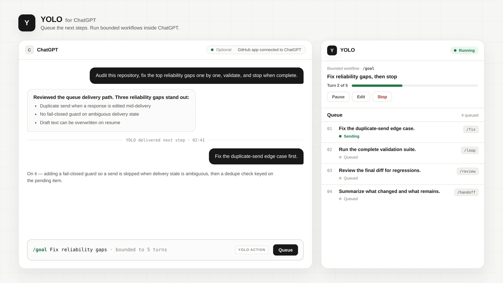
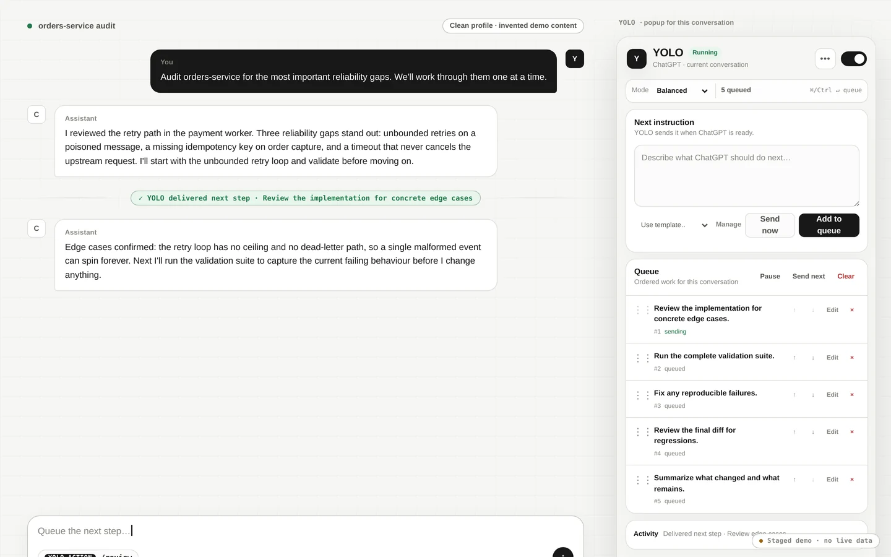
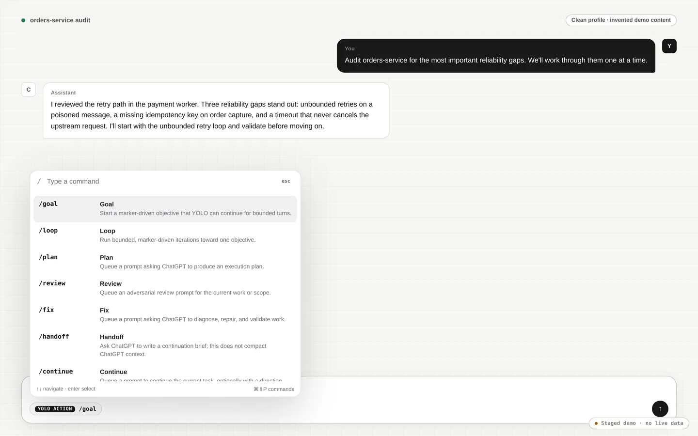
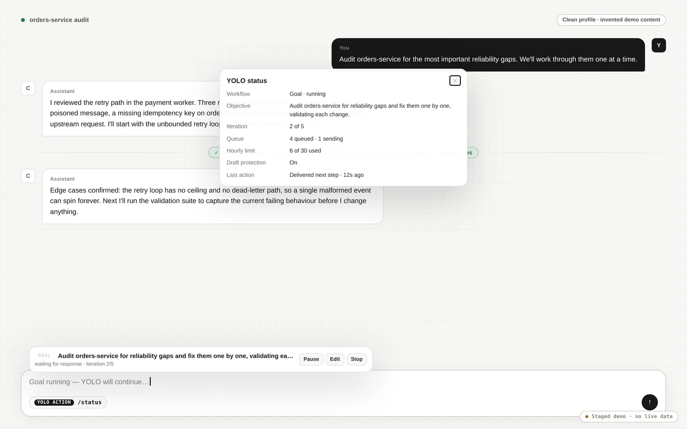
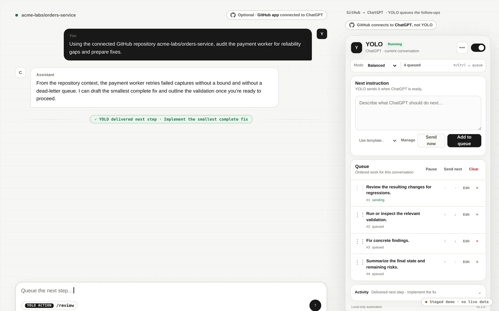
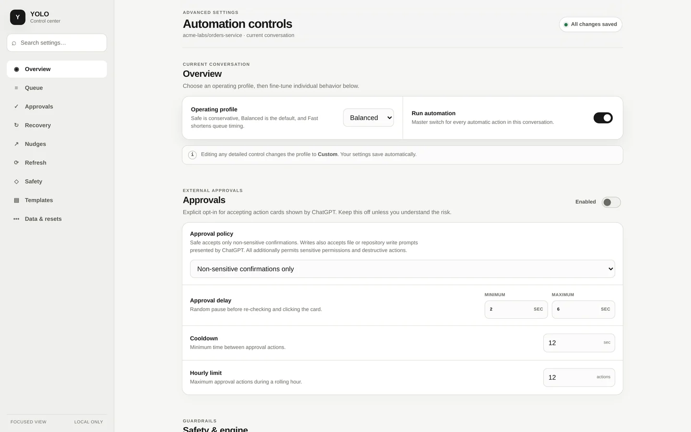
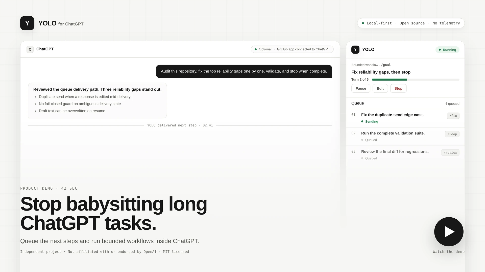

# YOLO for ChatGPT

**Queue the next steps. Run bounded workflows. Stop babysitting long ChatGPT conversations.**

A local-first Chromium extension that adds persistent instruction queues, composer-native actions, and visible, bounded automation to ChatGPT.

> **Independent project:** YOLO is not affiliated with or endorsed by OpenAI. It does not use the OpenAI API, run a backend, inject remote code, or collect telemetry.

[](https://github.com/kartikkabadi/chatgpt-yolo/actions/workflows/ci.yml)
[](https://github.com/kartikkabadi/chatgpt-yolo/actions/workflows/codeql.yml)
[](LICENSE)
[](manifest.json)



**[Install](#install) · [Watch the demo](#demo) · [Sponsor development](https://whop.com/vex-app/support-for-oss/)**

---

## Why YOLO

Long ChatGPT tasks still make you come back just to keep them moving — to send the next instruction, say *continue*, ask for another review, or run the next validation step. YOLO lets you line those steps up once and keeps them running inside the conversation, with everything visible and under your control.

### Queue the next steps

Add, reorder, edit, pause, retry, and safely deliver future instructions — per conversation, persisted locally.

### Run bounded workflows

Use `/goal` and `/loop` with visible state, explicit limits, and Pause/Edit/Stop controls. Nothing runs unbounded.

### Stay in control

Protect drafts, avoid duplicate sends, and pause when delivery becomes ambiguous. YOLO fails closed rather than guessing.

---

## What it adds to ChatGPT

YOLO adds four layers to ChatGPT:

1. **A persistent queue** for instructions that should run when the conversation is ready.
2. **Composer-native actions** for bounded workflows, prompt shortcuts, and extension controls.
3. **Safety controls** for approvals, recovery, nudges, stale tabs, and ambiguous delivery.
4. **A focused interface** that keeps everyday actions simple and moves detailed controls into Advanced settings.

Everything runs in the browser. Settings, queues, templates, and workflow state are stored in `chrome.storage.local`.

### Highlights

- Per-conversation persistent queues with drag ordering, editing, retry, pause, send-next, and fail-closed delivery recovery.
- `/goal <objective>` for marker-driven persistent objectives.
- `/loop [iterations] <objective>` for bounded iterative work; defaults to 12 and is hard-capped at 50 turns.
- `/plan`, `/review`, `/fix`, `/handoff`, and `/continue` prompt shortcuts.
- `/status`, `/pause`, `/resume`, `/stop`, `/settings`, and `/help` extension controls.
- Command palette from `/` in an empty composer or `Cmd/Ctrl + Shift + P`.
- Safe, Balanced, Fast, and Custom profiles.
- Approvals are off by default and require explicit opt-in; sensitive permissions and destructive actions require the All policy.
- Exact message receipts, durable queue-delivery identity, cross-tab side-effect leases, optimistic workflow revisions, and bounded storage.
- Mandatory draft protection: YOLO never replaces text already present in the composer.
- Templates with `{{date}}`, `{{time}}`, `{{platform}}`, and `{{conversation}}` variables.
- Versioned settings/template backups and privacy-safe diagnostics.
- No runtime dependencies, build framework, analytics, hosted service, or remote code.

## Product boundary

YOLO is deliberately a **normal Chrome extension**, not an agent platform.

The core repository does not include coding-agent hooks, a CLI, local daemon, MCP server, native-messaging host, filesystem or Git access, automatic code review/repair, or a hosted backend. Related experiments belong in separate repositories so the extension stays understandable, auditable, and easy to install.

See [Product direction](docs/PRODUCT_DIRECTION.md) for the principles, non-goals, roadmap, and success measures.

---

## Recommended for coding workflows: connect GitHub to ChatGPT

For repository work, the strongest setup pairs YOLO with **ChatGPT's GitHub app** (previously called the GitHub connector). The two are independent:

- **ChatGPT's GitHub app** provides repository context and, where your plan, app permissions, and enabled tools support it, repository actions.
- **YOLO** maintains the queue and bounded sequence of prompts inside the ChatGPT conversation.

To set it up:

1. Open **ChatGPT → Settings**.
2. Open **Apps**.
3. Find and connect **GitHub**.
4. Authorize only the repositories you want ChatGPT to access.
5. Select or invoke GitHub in the relevant conversation where necessary.
6. Then use YOLO to queue and bound the sequence of work.

> With GitHub connected, ChatGPT can inspect repository context and, where supported and authorized, help work through issues, code changes, reviews, and pull requests. YOLO keeps the sequence of instructions moving inside the conversation.

> **The GitHub app is optional and independent from YOLO.** YOLO never receives your GitHub credentials or repository data.

### Example coding workflow

Ask ChatGPT to inspect a repository issue or goal, then queue the follow-up steps in YOLO:

1. *Implement the smallest complete fix.*
2. *Review the resulting changes for regressions.*
3. *Run or inspect the relevant validation.*
4. *Fix concrete findings.*
5. *Summarize the final state and remaining risks.*

A bounded `/goal` or `/loop` can wrap the iterative middle of this sequence so it advances turn by turn with visible limits. Available GitHub capabilities vary by plan, mode, permissions, and rollout — YOLO does not add or change them; it only coordinates the next prompts.

---

## Screenshots


*The queue holds the next instructions per conversation, with clear ordering and item state.*


*Composer-native YOLO actions from `/` or `Cmd/Ctrl + Shift + P`.*


*Bounded workflows show the objective, remaining iterations, and explicit controls.*


*Connect GitHub to ChatGPT for repository context. YOLO keeps the next steps queued and bounded.*


*Advanced settings keep detailed controls — profiles, approvals, recovery, limits, and local data — out of the everyday path.*

## Demo

<a id="demo"></a>

[](docs/assets/demo-poster.webp)

A short walkthrough of queuing the next steps and running a bounded workflow inside a long ChatGPT conversation.

---

## Install

### From source (recommended today)

```bash
git clone https://github.com/kartikkabadi/chatgpt-yolo.git
cd chatgpt-yolo
npm run validate
npm run package
```

Then load `dist/yolo` as an unpacked extension.

### From a release archive

When a release is published, download the `yolo-v*.zip` asset from the [Releases](https://github.com/kartikkabadi/chatgpt-yolo/releases) page, unzip it, and load the `yolo` folder as an unpacked extension:

1. Open `chrome://extensions` in Chrome, Edge, Brave, Arc, or another Chromium browser.
2. Enable **Developer mode**.
3. Select **Load unpacked** and choose the unzipped `yolo` folder.
4. Open or refresh a ChatGPT conversation.

## First run

YOLO opens a local welcome page after a fresh install. The simplest setup is:

1. Open ChatGPT.
2. Keep the **Safe** or **Balanced** profile.
3. Add an instruction to the queue, or type `/` in the ChatGPT composer.
4. Enable automation for that conversation only when you are ready.

YOLO runs durable automation only inside saved ChatGPT conversations with a stable `/c/<conversation-id>` URL. New-chat and transient routes remain manual until ChatGPT assigns a durable conversation URL.

## Slash actions

These are **YOLO extension actions**, not native ChatGPT commands. Automated workflows are implemented by YOLO. Prompt shortcuts turn an action into a visible queued prompt; they do not unlock hidden ChatGPT capabilities or modify ChatGPT's context window.

### Automated workflows

| Action | Purpose |
| --- | --- |
| `/goal <objective>` | Run a bounded persistent objective. Every turn must end with `[YOLO:CONTINUE]`, `[YOLO:DONE]`, or `[YOLO:BLOCKED]`. |
| `/loop [count] <objective>` | Run bounded iterations. Missing or malformed terminal markers pause the loop instead of guessing. |

### Prompt shortcuts

| Action | Purpose |
| --- | --- |
| `/plan <task>` | Queue a prompt asking ChatGPT to produce an execution plan. |
| `/review [scope]` | Queue an adversarial review prompt. |
| `/fix [scope]` | Queue a diagnose, repair, and validate prompt. |
| `/handoff [focus]` | Queue a prompt asking ChatGPT to write a continuation brief. It does **not** compact or alter ChatGPT context. |
| `/continue [direction]` | Queue a prompt to continue the current task with an optional direction. |

### YOLO controls

| Action | Purpose |
| --- | --- |
| `/status` | Show workflow, queue, runner, generation, profile, limits, and last action. |
| `/pause`, `/resume`, `/stop` | Pause, resume, or stop and clear the active workflow. |
| `/settings`, `/help` | Open Advanced settings or the action palette. |

Only standalone terminal markers control automated workflows. Inline marker-shaped text is ignored.

## Queue reliability

A background service worker owns every queue mutation. **Every automatic text submission**—queued instructions, workflow turns, recovery Continue prompts, and deep nudges—uses this one durable outbox. A content script must claim an item, persist submission intent before touching the composer, verify the composer retained the exact text, and observe a new matching user message before completing the exact claim.

YOLO fails closed when delivery is ambiguous. It does not automatically retry a message that may already have been submitted. Repeated automatic prompts are deduplicated across tabs during their cooldown window.

Other safeguards include:

- One active queue sender lease per conversation.
- One background-owned cross-tab guard for approvals and refreshes.
- Executing side effects that lose their outcome become **unknown** and remain blocked until an explicit runtime reset.
- Idempotent completion after lost acknowledgments.
- Strict pending order during retries.
- Bounded queue size, text capacity, completion history, events, and active conversations.
- Route identity checks after ChatGPT single-page navigation.
- Stable-response windows before a workflow advances.
- User-prompt fingerprints that stop a workflow when you manually change direction.

## Profiles and automation

- **Safe:** slower queue cadence, conservative limits, approvals off, no automatic nudges or refreshes.
- **Balanced:** normal cadence, approvals off, and recovery enabled.
- **Fast:** faster cadence and higher limits, with approvals still off until explicitly enabled.
- **Custom:** any manually adjusted configuration.

Advanced settings expose queue timing, retries, approvals, recovery, nudges, refresh, engine limits, templates, data portability, and reset actions. Search and section navigation keep those controls out of the everyday path.

## Backups and diagnostics

Advanced settings can download or restore a versioned JSON backup containing global settings, per-conversation settings, and templates. The entire file is validated before confirmation and application. A one-time preview token rejects a changed file, replay, expiry, or concurrent settings/template mutation.

Backups deliberately exclude active queues, queued instruction text, goals, workflow objectives, claims, retries, counters, and ChatGPT messages. Importing a backup cannot resume stale automation. If the current conversation is present in the backup, YOLO also synchronizes those restored settings into the open ChatGPT tab.

Privacy-safe diagnostics contain only versions, feature toggles, counts, queue states, and error/action codes. They exclude conversation identifiers and all user-authored prompt, template, queue, workflow-objective, and message text. See the [data portability contract](docs/DATA_PORTABILITY.md).

## Permissions and privacy

YOLO requests only:

- `storage` — local settings, queues, templates, and workflow state.
- `alarms` — bounded scheduling while the Manifest V3 service worker is asleep.
- `scripting` — restore packaged content scripts in matching ChatGPT tabs after installation or update.
- Host access to `https://chatgpt.com/*` and its subdomains — no other website is supported.

YOLO does not request `activeTab`, `tabs`, optional localhost access, native messaging, broad web access, cookies, or browser-history access. See [PRIVACY.md](PRIVACY.md) and [Browser permissions](docs/PERMISSIONS.md) for the precise data and permission model.

## Compatibility and responsibility

YOLO automates a third-party web interface whose DOM and behavior can change without notice. It does not bypass rate limits, access controls, safety systems, or subscription restrictions. Users are responsible for ensuring their use complies with applicable service terms and local law.

Model output remains probabilistic. YOLO's workflow markers and queue receipts provide control-flow reliability; they do not make the model's answer correct. Consequential work still needs appropriate verification.

## Development

Requirements: Node.js 20 or newer. There are no npm dependencies.

```bash
npm run check
npm test
npm run verify:extension
npm run validate
npm run package
```

`npm run verify:extension` enforces the extension-only boundary: narrow permissions and hosts, no optional localhost/native surfaces, no remote or dynamic code, and no CLI/agent/server files in the runtime allowlist.

`npm run package` creates a clean, allowlisted extension directory at `dist/yolo`. It packages only runtime files plus the README, MIT license, notice, and privacy policy; it excludes tests, repository metadata, contributor documentation, and development scripts.

Architecture and invariants are documented in [Architecture](docs/ARCHITECTURE.md) and the [Reliability model](docs/RELIABILITY_MODEL.md). Contributions must preserve fail-closed delivery, durable conversation scoping, mandatory draft protection, bounded automation, and the content-script order in `manifest.json`.

## Release verification

Every release must pass automated validation and a manual unpacked-extension smoke pass against the current live ChatGPT interface. ChatGPT does not expose a stable public DOM contract, so selector compatibility cannot be guaranteed by unit tests alone.

See [Releasing](docs/RELEASING.md) and [Troubleshooting](docs/TROUBLESHOOTING.md).

## Support development

YOLO is free and open source. Maintaining a browser extension against a changing third-party interface requires ongoing testing, compatibility fixes, and development tooling. If it saves you time, a $5 or $10 contribution helps keep the project maintained.

**[Sponsor development](https://whop.com/vex-app/support-for-oss/)**

You can also help by:

- Starring the repository.
- Reporting reproducible bugs with clear steps.
- Contributing fixes and improvements.
- Sharing the project with people who run long ChatGPT tasks.

## Contributing and security

- [Contributing](CONTRIBUTING.md)
- [Security policy](SECURITY.md)
- [Code of conduct](CODE_OF_CONDUCT.md)
- [Support](SUPPORT.md)

## License

MIT. See [LICENSE](LICENSE).
